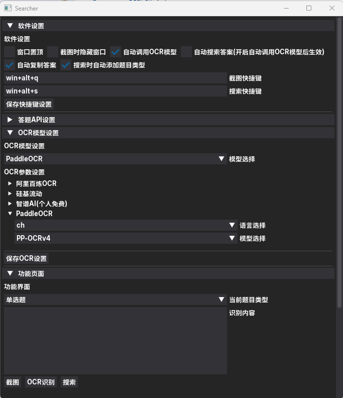

<!-- <p align="center">
  <a href="https://github.com/destoryD/screen-searcher">
    
  </a>
</p> -->

<div align="center">
<h1 align="center">
📷 Screen-Searcher - 智能 OCR 屏幕搜索工具 | 一键截图搜题<br>
</h1>
<p style="font-size: 8px;">一款基于OCR技术的桌面应用程序，可通过截图快速搜索屏幕上的任意题目。</p>
</div>

<p align="center">
  <a href="https://github.com/destoryD/screen-searcher/releases/latest">
    
  </a>
  <a href="LICENSE">
    
  </a>
  <a href="https://github.com/destoryD/screen-searcher/releases">
    
  </a>
  <a href="https://star-history.com/#destoryD/screen-searcher">
    
  </a>
   
</p>

## 📚 项目介绍

Screen-Searcher 是一款基于 OCR 技术的桌面应用程序，可通过截图快速搜索屏幕上的任意题目。无论是在线考试、学习平台还是电子文档，只需一键截图，即可获取答案和相关知识点解析。

## ✨ 核心功能

| 🚀 功能特性 | 📝 详细说明 |
|------------|------------|
| **智能截图识别** | 支持全屏/区域截图，自动识别文字内容 |
| **多引擎 OCR** | 集成阿里百炼、硅基流动、智谱AI、PaddleOCR 等多种识别引擎 |
| **智能搜题** | 支持 LIKE 知识库和 OpenAI 兼容 API 搜索答案 |
| **自定义快捷键** | 可自定义截图、搜索等操作的快捷键 |
| **多种题型支持** | 支持单选、多选、判断、填空等多种题型 |
| **自动化工作流** | 支持截图后自动 OCR、自动搜索、自动复制答案 |

## 🔧 安装使用

### 方式一：下载发行版（推荐）

[](https://github.com/destoryD/screen-searcher/releases)

下载后解压即可使用，无需安装。

### 方式二：从源码运行

```bash
# 克隆仓库
git clone https://github.com/destoryD/screen-searcher.git
cd screen-searcher

# 安装依赖
pip install -r requirements.txt

# 安装PaddleOCR(可选)
pip install paddlepaddle paddle-ocr

# 启动程序
python src/main.py

```

## 📖 使用指南

1. **设置 OCR 引擎**：在"OCR 模型设置"中选择并配置 OCR 引擎
2. **设置搜索 API**：在"答题 API 设置"中配置知识库接口
3. **截图搜题**：使用快捷键（默认 Ctrl+Q）截取屏幕上的题目
4. **获取答案**：系统自动识别并搜索答案，结果将显示在界面上

详细使用说明请查看 [快速开始指南](docs/quickstart.md)

## ❤️ CONTRIBUTORS


<a href="https://github.com/destoryD/screen-searcher/graphs/contributors">
  
</a>

## 反馈&交流


<div align="center">

[](https://qm.qq.com/q/kJ7lKBhtkc)


</div>

## 📄 开源协议

本项目采用 MIT 许可证，完整内容请查看 `LICENSE` 文件。
