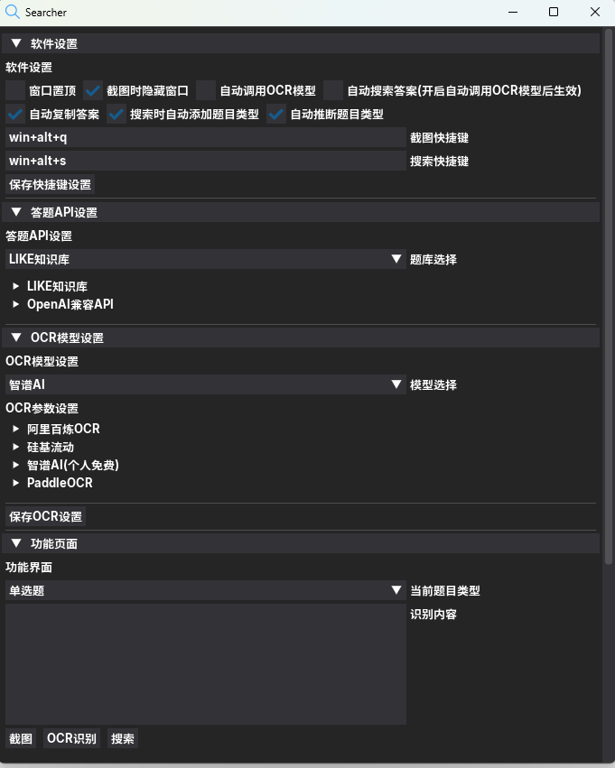

<!-- <p align="center">
  <a href="https://github.com/destoryD/screen-searcher">
    
  </a>
</p> -->

<h1 align="center">
🚀 Screen-Searcher - OCR屏幕搜索工具<br>
<span style="font-size: 0.8em;">一款基于OCR技术的桌面应用程序，可通过截图快速搜索屏幕上的任意题目。</span>
</h1>

<p align="center">
  <a href="https://github.com/destoryD/screen-searcher/releases/latest">
    
  </a>
  <a href="LICENSE">
    
  </a>
  <a href="https://github.com/destoryD/screen-searcher/releases">
    
  </a>
  <a href="https://star-history.com/#destoryD/screen-searcher">
    
  </a>
</p>

<div align="center">
  <h3>
    <a href="#-功能特性">
      功能特性
    </a>
    <span> • </span>
    <a href="#-安装指南">
      安装指南
    </a>
    <span> • </span>
    <a href="docs/quickstart.md">
      快速开始
    </a>
    <span> • </span>
    <a href="#-参与贡献">
      贡献指南
    </a>
  </h3>
</div>


<p align="center">
  
</p>

## ✨ 功能特性

<div align="center">

| 🎯 核心功能          | 🌈 特色亮点               |
|----------------------|--------------------------|
| 📷 一键截图搜索       | 🖥️ 跨平台图形界面         |
| 🔍 多引擎OCR识别      | ⚡ 可自定义快捷键         |
| 🌐 100+语言支持       | 📚 智能搜索建议           |
| 🚀 知识库集成         | 🧩 模块化插件系统         |

</div>

## 🛠️ 安装指南

### 免安装版本
[](https://github.com/destoryD/screen-searcher/releases)

### 开发者安装
```bash
# 克隆仓库
git clone https://github.com/destoryD/screen-searcher.git
cd screen-searcher

# 安装依赖
pip3 install -r requirements.txt

# 可选安装PaddleOCR
pip3 install paddlepaddle paddle-ocr

# 启动程序
python src/main.py
```

## ❤️ CONTRIBUTORS


<a href="https://github.com/destoryD/screen-searcher/graphs/contributors">
  
</a>

## 📄 开源协议

本项目采用 MIT 许可证，完整内容请查看 `LICENSE` 文件。
