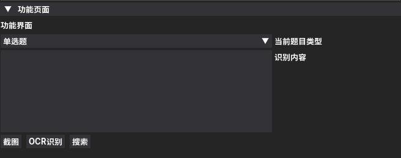

## 🚀 快速开始

- ### 设置题库Token

    当前版本软件内置的题库为`LIKE知识库`,需要设置Token才能正常使用,请前往[LIKE知识库](https://www.datam.site/)申请Token,申请完成后将Token填入软件设置中即可。

    填写完成后点击`保存API配置`即可。

    注意：请不要随意修改api地址，否则会导致无法使用！

    

- ### 设置OCR接口

    当前软件支持的OCR接口如下：
    - **通义百炼**
    - **智谱AI**
    - **硅基流动**
    - **PaddleOCR**
    
    软件任意选择一个接口即可正常使用，推荐使用`智谱AI`接口，个人使用完全免费。

    #### 通义百炼

    

    点击`官网按钮`，进入阿里官方网站，登录后在右上角找到`API-Key`，点击`创建API`，创建完成后点击`复制`按钮，将复制的内容粘贴到软件中即可。

    

    

    #### 智谱AI
    
    
    点击`官网按钮`，进入智谱网站，登录后在右上角找到`个人中心`，点击左侧`API Keys`，创建完成后将内容粘贴到软件中即可。

    

    

    #### 硅基流动
    
    
    #### PaddleOCR
    

- ### 一键截图搜索

    

    打开`功能页面`，点击`截图`按钮，即可进行截图，再点击`OCR识别`即可自动识别图片中的文字内容，待识别完成后，选择`题目类型`，再点击`搜索`按钮即可完成题目查询。

    可以在`软件设置`页面，设置自动OCR识别以及自动搜索答案，勾选即可。
    
    